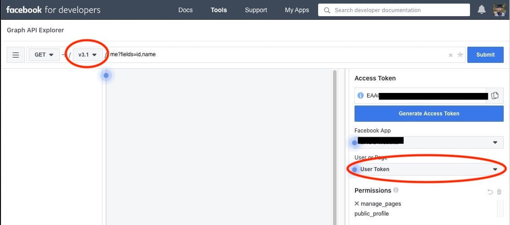

# Facebook Permanent Token

There are [various guides](https://medium.com/p/a96470dc03ca/responses/show), [stackoverflow posts](http://stackoverflow.com/questions/17197970/facebook-permanent-page-access-token), [youtube videos](https://www.youtube.com/watch?v=FtboHvg3HtY), etc on how to get a permanent page/user token for your Facebook application.

One use case: if a Facebook Page isn't completely public (not visible from incognito window), but you'd like to poll the Events that that Page has, you will need a permanent token for your app to view that data.

---
## Usage
 
### Get Permanent Page Access Token
##### (As of April 2020, page tokens seem to not be permanent)

1. Get `app_id` and `app_secret` https://developers.facebook.com/apps

1. Get `page_id` either from https://developers.facebook.com/apps or from page's About section

1. Get `short_lived_token` from https://developers.facebook.com/tools/explorer

   * Facebook App: (Your app's name)
   * User or Page: (Your page's name)
   * Permissions: at least `user_events`
   
   Then copy the access token. This will be the `{short_lived_token}`
   
   

1. Put `app_id`, `app_secret`, `page_id` and `short_lived_token` into [config.ini](config.ini), or pass them as CLI args

1. `python3 page.py`

---

### Get Permanent User Access Token

1. Get `app_id` and `app_secret` https://developers.facebook.com/apps

1. Get `short_lived_token` from https://developers.facebook.com/tools/explorer

   * Facebook App: (Your app's name)
   * User or Page: User Token
   * Permissions: at least `manage_pages`
   
   Then copy the access token. This will be the `{short_lived_token}`
   
   

1. Put `app_id`, `app_secret`, and `short_lived_token` into [config.ini](config.ini), or pass them as CLI args

1. `python3 user.py`
